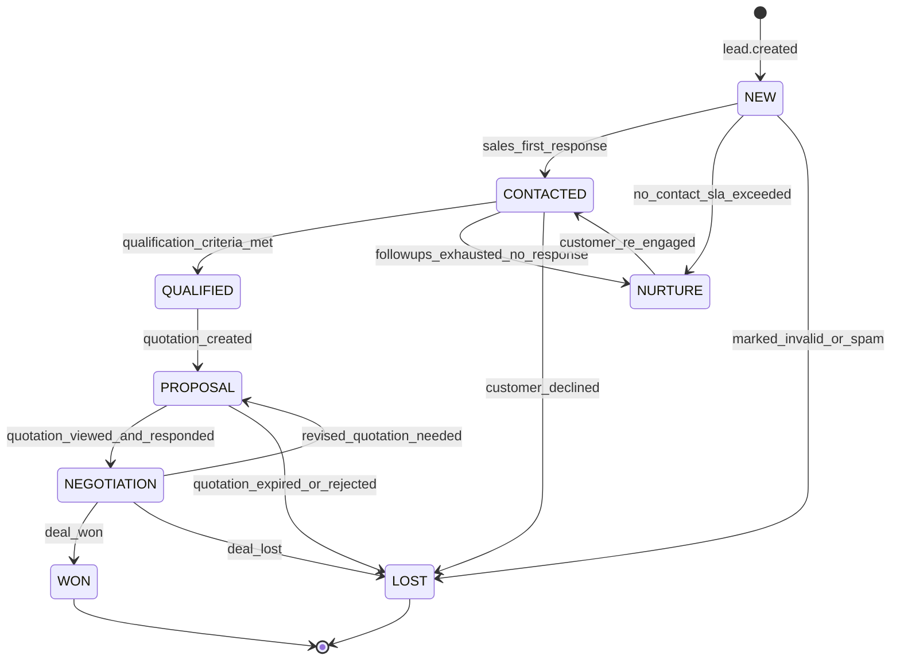

# TATA Sales — Lead State Machine

Berdasarkan blueprint §12 (lead status), §27 (pipeline), §96-97 (response time & priority). Disimpan sebagai baris di `pipeline_stages` per tenant (customizable — §27, §75), tapi berikut ini adalah **default pipeline** yang di-seed untuk tenant baru dan jadi acuan validasi di `LeadService::transition()`.

## Dua dimensi yang terpisah

Lead punya dua atribut yang **tidak saling menggantikan**:

1. **`status`** — posisi di pipeline (state machine di bawah). Menentukan proses bisnis apa yang sedang berjalan.
2. **`temperature`** (`COLD/WARM/HOT`) — turunan murni dari `score` (§15: 0-29 COLD, 30-59 WARM, 60-100 HOT). Tidak menggerbang transisi status, tapi menentukan **prioritas & SLA notifikasi** (§60, §97) — lead HOT di status NEW tetap butuh respons dalam hitungan menit, sementara lead COLD di status NEW bisa masuk antrian follow-up rule-based biasa.

## Diagram state

## Tabel transisi lengkap

| Dari | Ke | Trigger | Guard | Efek samping |
|---|---|---|---|---|
| *(start)* | `NEW` | `lead.created` (form/WA/chat/manual/API) | Validasi lolos, customer resolved (§112) | `lead_events: lead_created`, scoring awal, `AssignmentService` jalan, `notifications: new_lead` |
| `NEW` | `CONTACTED` | Sales membalas pertama kali, atau follow-up terjadwal terkirim & dibalas | `assigned_to` sudah terisi | `lead_events: message_sent`, mulai hitung **sales response time** (§96) |
| `NEW` | `NURTURE` | Tidak ada kontak sampai `followup_steps` habis | Tidak ada respons sales/customer dalam window rule | `lead_events`, notifikasi ke manager (lead panas yang terlewat harus flag khusus) |
| `NEW` | `LOST` | Ditandai manual sebagai invalid/spam | Role `manager`+ | `audit_logs: lead.status_changed` |
| `CONTACTED` | `QUALIFIED` | Qualification Agent atau sales manual mengonfirmasi `budget, timeline, product_interest, purchase_intent` | Minimal field qualifikasi terisi (configurable per tenant) | `lead_events: qualified` |
| `CONTACTED` | `NURTURE` | Follow-up sequence habis tanpa respons customer | — | Idem NEW→NURTURE |
| `CONTACTED` | `LOST` | Customer eksplisit menolak | — | `audit_logs` |
| `QUALIFIED` | `PROPOSAL` | `quotation_created` | Quotation berhasil dibuat (§99) | `lead_events: quotation_created` |
| `PROPOSAL` | `NEGOTIATION` | Quotation dilihat + customer merespons/bertanya | `quotations.status = viewed` + ada aktivitas balasan | `lead_events: quotation_viewed` |
| `PROPOSAL` | `LOST` | Quotation kadaluarsa (`valid_until` lewat) tanpa respons, atau ditolak | — | `quotations.status = expired/rejected` |
| `NEGOTIATION` | `WON` | `deal_won` (aksi sales, opsional dikonfirmasi pembayaran) | Role `sales`/`manager` | `lead_events: won`, trigger event `deal.won` (webhook keluar, §140) |
| `NEGOTIATION` | `LOST` | `deal_lost` | — | `lead_events: lost`, trigger `deal.lost` |
| `NEGOTIATION` | `PROPOSAL` | Perlu quotation revisi | Quotation baru dibuat | Loop kembali, quotation lama ditandai superseded |
| `NURTURE` | `CONTACTED` | Customer re-engage (buka WA, isi form lagi, klik promo) | Ada `lead_events` baru | Lead "dihidupkan" kembali, masuk antrian sales lagi |

## Aturan desain penting

- **`WON` dan `LOST` adalah terminal** — tidak ada transisi keluar dari keduanya. Kalau customer yang sama datang lagi setelah `LOST` (mis. minat produk lain, atau berubah pikiran), sistem membuat **lead baru** yang tertaut ke `customer_id` yang sama, bukan membuka kembali lead lama. Ini menjaga riwayat pipeline tetap bersih dan `won_rate`/`lost_rate` tetap akurat secara historis (selaras dengan §13: satu customer bisa punya banyak lead).
- **Transisi ilegal ditolak di `LeadService::transition()`**, bukan hanya di UI — termasuk kalau yang meminta perubahan adalah AI lewat tool `update_lead` (§118: AI tidak boleh mengubah status transaksi tanpa lewat rule).
- **Pipeline alternatif** yang disebut blueprint (`NEW → NO_RESPONSE → FOLLOW-UP 1 → FOLLOW-UP 2 → QUALIFIED`, §27) adalah contoh kustomisasi tenant — secara struktur data itu berarti tenant tersebut punya baris `pipeline_stages` tambahan (`NO_RESPONSE`, `FOLLOW_UP_1`, `FOLLOW_UP_2`) dan workflow (§34) yang menggerakkan lead di antara stage-stage itu sebelum sampai `QUALIFIED`. Core state machine di atas tetap jadi kerangka default; tenant meng-override lewat `pipeline_stages` + `workflows`, bukan lewat kode baru.
- **SLA / lead panas cepat dingin (§96)**: setiap transisi `NEW → CONTACTED` mencatat delta waktu dari `leads.created_at`. Dashboard menampilkan rata-rata (target contoh: `4m 32s`). Lead `HOT` yang masih `NEW` lebih dari SLA tenant memicu notifikasi eskalasi ke manager, terlepas dari status pipeline-nya.
